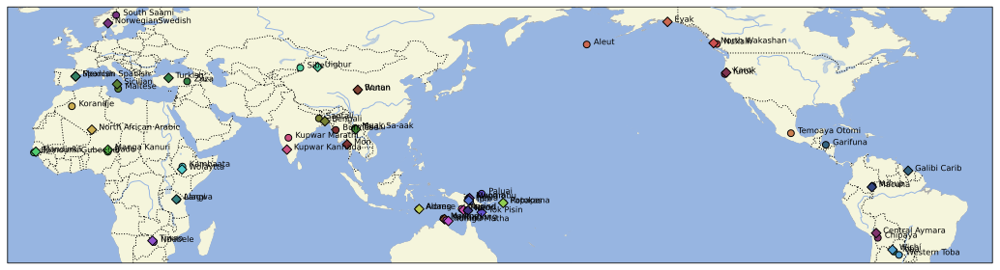
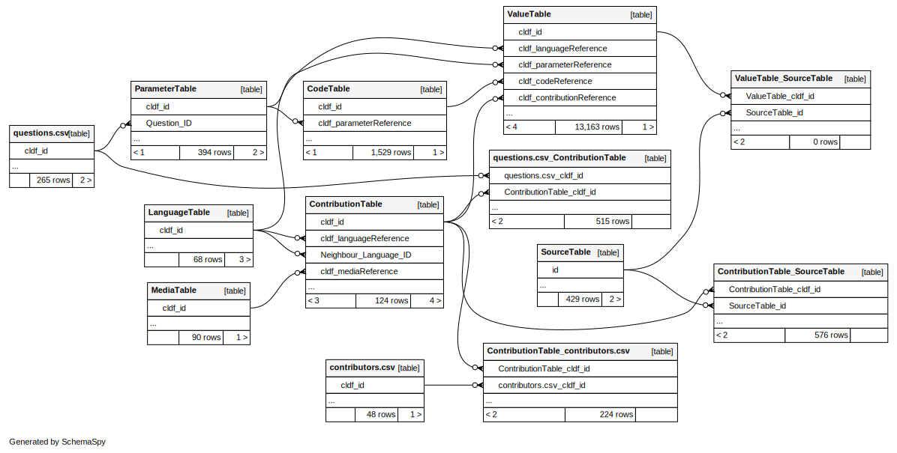

# GramAdapt Crosslinguistic Social Contact Dataset

## How to cite

If you use these data please cite
- the original source
  > Eri Kashima, Francesca Di Garbo, Oona Raatikainen, Rosnátaly Avelino, Sacha Beck, Anna Berge, Ana Blanco, Ross Bowden, Nicolás Brid, Joseph M Brincat, María Belén Carpio, Alexander Cobbinah, Paola Cúneo, Anne-Maria Fehn, Saloumeh Gholami, Arun Ghosh, Hannah Gibson, Elizabeth Hall, Katja Hannß, Hannah Haynie, Jerry Jacka, Matias Jenny, Richard Kowalik, Sonal Kulkarni-Joshi, Maarten Mous, Marcela Mendoza, Cristina Messineo, Francesca Moro, Hank Nater, Michelle A Ocasio, Bruno Olsson, Ana María Ospina Bozzi, Agustina Paredes, Admire Phiri, Nicolas Quint, Erika Sandman, Dineke Schokkin, Ruth Singer, Ellen Smith-Dennis, Lameen Souag, Yunus Sulistyono, Yvonne Treis, Matthias Urban, Jill Vaughan, Deginet Wotango Doyiso, Georg Ziegelmeyer, Veronika Zikmundová. (2023). GramAdapt Crosslinguistic Social Contact Dataset. (1.0.0) [Data set]. Zenodo. https://doi.org/10.5281/zenodo.7508054
- the derived dataset using the DOI of the [particular released version](../../releases/) you were using

## Description

The GramAdapt Crosslinguistic Social Contact Dataset is a pioneering dataset with social, cultural, and demographic data about contact scenarios from across the globe. The data mostly concern interactions between a Focus language community and it's Neighbour language community, with 34 contact pairs represented. The data are qualitative with quantitative potential, where language community experts have provided best-assessment answers to questions about social contact in their communities of expertise.

This dataset is licensed under a CC-BY-4.0 license

## Contact pairs

## Data model

For detailed descriptions of the tables and columns refer to [cldf/README.md](cldf/README.md).

## Notes

### Respondent comments vs Reviewer comments

Comments are directly written by the authors of the respective set. For multiauthor sets, the specific respondent can be identified by the name associated with the particular answer by looking at the `Respondent` column in the `ValueTable`.

Any comments in [square brackets] are those included by the editorial team for clarification.

### About the timeframe

Each contact set is unique in terms of the timeframe they respond for. We urge researchers who use this dataset to read the `Value` and `Comment` columns in `ValueTable` for answers to questions marked as timeframe comments (via the `Is_Timeframe_Comment` in `ParameterTable`) carefully for each set, to get a sense of the heterogeneity of timeframes represented in each set, as well as the whole dataset.

The timeframes given are broad and coarse approximations, often negotiated between the respondent and reviewer. These timeframes are to be used with caution. Always read the associated comments.

An end date of 2020 (or later) indicates that social contact is ongoing at the time of data collection in 2021. 

### Idiosyncratic contact sets

Set26 "Garifuna - Galibi" only contains responses for the Overview.
Set10 "FLNA - NLNA" and set22 "Muak Sa-aak - Tai Lue" have restricted public access to the data; see "Data Sensitivity" section below.

### Data Sensitivity

The respondents of sets 10 and 22 have requested access restrictions to their respective datasets. 

The respondent of set10 has requested to have community identifying names anonymised. The respondent name for set 10 has also been anonymised. If you wish to access the community identifying names for set10, please contact Kaius Sinnemäki at the University of Helsinki, and he will get in contact with the author of set10. 

The respondent for set22 has requested to make certain comments publicly invisible, due to their potentially sensitive nature. If you wish to access the invisible comments of set 22, please contact the author directly.

## CLDF Datasets

The following CLDF datasets are available in [cldf](cldf):

- CLDF [StructureDataset](https://github.com/cldf/cldf/tree/master/modules/StructureDataset) at [cldf/StructureDataset-metadata.json](cldf/StructureDataset-metadata.json)