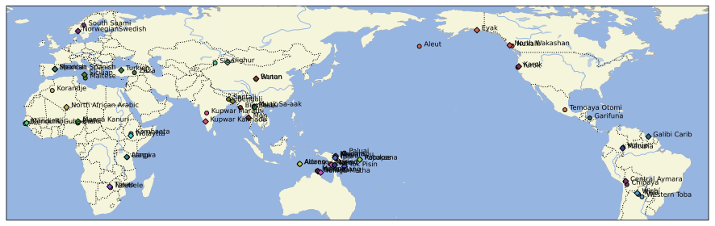

# GramAdapt Crosslinguistic Social Contact Dataset

## How to cite

If you use these data please cite
- the original source
  > Eri Kashima, Francesca Di Garbo, Oona Raatikainen, Rosnátaly Avelino, Sacha Beck, Anna Berge, Ana Blanco, Ross Bowden, Nicolás Brid, Joseph M Brincat, María Belén Carpio, Alexander Cobbinah, Paola Cúneo, Anne-Maria Fehn, Saloumeh Gholami, Arun Ghosh, Hannah Gibson, Elizabeth Hall, Katja Hannß, Hannah Haynie, Jerry Jacka, Matias Jenny, Richard Kowalik, Sonal Kulkarni-Joshi, Maarten Mous, Marcela Mendoza, Cristina Messineo, Francesca Moro, Hank Nater, Michelle A Ocasio, Bruno Olsson, Ana María Ospina Bozzi, Agustina Paredes, Admire Phiri, Nicolas Quint, Erika Sandman, Dineke Schokkin, Ruth Singer, Ellen Smith-Dennis, Lameen Souag, Yunus Sulistyono, Yvonne Treis, Matthias Urban, Jill Vaughan, Deginet Wotango Doyiso, Georg Ziegelmeyer, Veronika Zikmundová. (2023). GramAdapt Crosslinguistic Social Contact Dataset. (1.0.0) [Data set]. Zenodo. https://doi.org/10.5281/zenodo.7508054
- the derived dataset using the DOI of the [particular released version](../../releases/) you were using

## Description

This dataset is a first attempt at collecting socio-cultural-demographic data about contact scenarios, including attempts at quantification as well as qualitative elaborations by respondents.

Respondents were approached as academic collaborators, not as volunteers in an experiment. Respondents were not chosen at random. Respondents were chosen based on their published research and fieldwork experience with either or both Focus and Neighbour language communities.

This dataset is licensed under a CC-BY-4.0 license

## Contact pairs

## Data model

## CLDF Datasets

The following CLDF datasets are available in [cldf](cldf):

- CLDF [StructureDataset](https://github.com/cldf/cldf/tree/master/modules/StructureDataset) at [cldf/StructureDataset-metadata.json](cldf/StructureDataset-metadata.json)