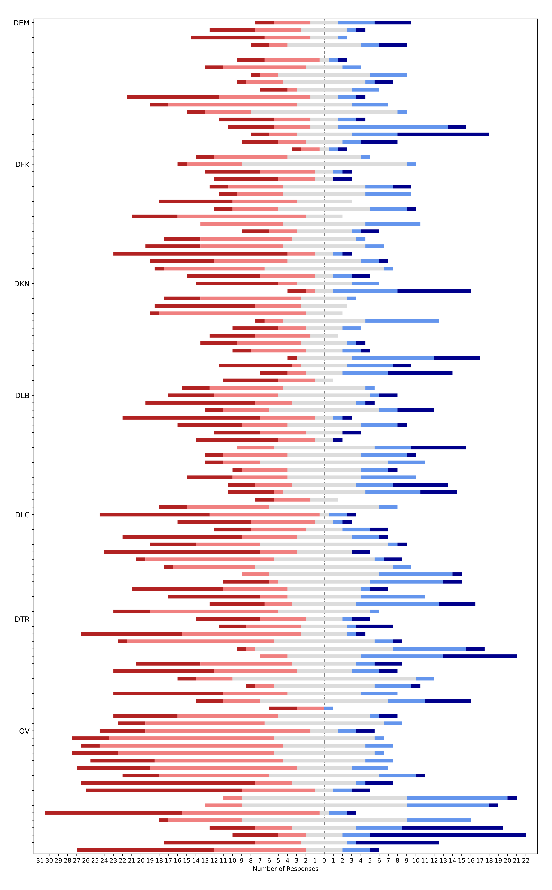

# Validating the CLDF dataset

Run CLDF validation:
```shell
cldf validate cldf --with-cldf-markdown
```

Make sure the dataset can be loaded into SQLite:
```shell
rm gramadapt.sqlite
cldf createdb cldf gramadapt.sqlite
```

## Technical validation described in the paper

The GramAdapt dataset has been designed to cover diverse contact scenarios as well as a diverse set
of languages. As such, it presents a first attempt or an exploration of the problem space rather than
a set of measurements for parameters with known meaning and expectations about the results.
Thus, validating the dataset boils down to validating the questionnaire, i.e. making sure suitable
questions were asked.


### Suitablity of domain selection

Questions P1 ask (for each social domain) whether the social domain in question has ever been a domain 
of social contact between Focus and Neighbour Group peoples.

Thus, the relevance of the social domains for the contact scenarios can be computed as precentage of
sets with a "Yes" answer to the P1 questions as follows
```sql
SELECT domain, yes, no, NA, ratio FROM (
    SELECT
        p.domain,
        sum(CASE c.cldf_name WHEN 'Yes' THEN 1 ELSE 0 END) AS 'yes',
        sum(CASE c.cldf_name WHEN 'Yes' THEN 0 ELSE 1 END) AS 'no',
        sum(CASE c.cldf_name WHEN NULL THEN 1 ELSE 0 END) AS 'NA',   
        round(cast(sum(CASE c.cldf_name WHEN 'Yes' THEN 1 ELSE 0 END) AS float) * 100 / count(v.cldf_id), 2) AS ratio
    FROM valuetable AS v 
    JOIN codetable AS c
        ON v.cldf_codereference = c.cldf_id
    JOIN parametertable AS p 
        ON v.cldf_parameterreference = p.cldf_id
    JOIN "questions.csv" AS q 
        ON q.cldf_id = p.question_id
    JOIN "questions.csv_ContributionTable" AS qc
        ON q.cldf_id = qc."questions.csv_cldf_id"
    WHERE qc.contributiontable_cldf_id = 'P1'
    GROUP BY p.domain
)
ORDER BY ratio;
```
yielding

domain | yes | no | NA | % yes
--- | ---:| ---:| ---:| ---
DEM|20|14|0|58.82
DKN|22|12|0|64.71
DFK|27|7|0|79.41
DLB|27|7|0|79.41
DLC|30|4|0|88.24
DTR|32|2|0|94.12


which can be summarized (after putting the SQL query into a file `q.sql`) as
```shell
$ sqlite3 gramadapt.sqlite --header < q.sql | csvstat -c yes_ratio -d "|" 
  2. "yes_ratio"

        Smallest value:        0.588
        Largest value:         0.941
        Mean:                  0.775
        Median:                0.794
        StDev:                 0.135

Row count: 6
```


Contact sets partitioned into groups with equal number of relevant social domains can be computed as
```sql
SELECT 
    ndom, 
    group_concat(substr(set_id, 4), ', ') AS sets, 
    count(set_id) AS total 
FROM (
    SELECT 
        count(DISTINCT p.cldf_id) AS ndom, 
        v.cldf_contributionReference AS set_id 
    FROM valuetable AS v 
    JOIN codetable AS c 
         ON v.cldf_codereference = c.cldf_id 
    JOIN parametertable AS p 
         ON v.cldf_parameterreference = p.cldf_id 
    JOIN "questions.csv" AS q 
         ON q.cldf_id = p.question_id
    JOIN "questions.csv_ContributionTable" AS qc
         ON q.cldf_id = qc."questions.csv_cldf_id"
    WHERE qc.contributiontable_cldf_id = 'P1' AND c.cldf_name = 'Yes' 
    GROUP BY v.cldf_contributionReference
)
group by ndom 
order by ndom desc;
```

ndom | sets | total
---:| --- | ---:
6|02, 05, 06a, 07, 09, 12, 17, 18, 21, 22, 24, 25, 30|13
5|23, 27, 29|3
4|03, 04, 08, 10, 13, 15, 19, 20, 28, 32|10
3|01, 14, 16, 31, 33, 34|6
1|11|1


### Visualizing responses per datatype

To further assess the suitability of the questionnaire, we visualize the answers grouped by datatype.

The following three plots are created running `cldfbench` sub-commands.
Running these commands requires "installing" the dataset via `pip install -e .`, to install `cldfbench`
and register the subcommands.


#### Responses to binary questions

The following plot shows the answers to the yes-no questions as clustered heatmap (with grey meaning
missing data). Columns correspond to contact sets, rows to questions.
The leftmost column color-codes the questions by social domain. Questions often cluster
by domain - mostly because of systematically, by-domain missing data; but this is not always the case.


#### Responses to categorical questions

Of the 65 questions with answers from a fixed set of categories, 38 dealt with language selection. These
38 questions allowed the following answers:
- The Focus Group language
- The Neighbour Group language
- Some other language
- This is highly contextual
- B

and the answers were distributed as shown below, indicating that the questions capture diversity
among the contact sets.


#### Responses to Likert-scale question

112 questions had answers mapped to a five-point [Likert scale](https://en.wikipedia.org/wiki/Likert_scale).
Ideally, questions would be assigned such that answers differ between contact sets. The distribution
of answers to the Likert-scale questions is shown below, again indicating that questions as well as 
response options are suitable to capture diversity between the sets.




#### Questions of type *Comment*

The questions with responses of datatype `Comment` are clearly not meant for quantitative analysis - and
qualitative analysis is somewhat hampered by the tabular format of the data. But since CLDF data can
easily be loaded into a clld web application for visualization, inspecting the `Comment` data can be
done through-the-web (see for example https://gramadapt.clld.org/parameters/DEM01).


#### Time-range questions

While the numeric data associated to time-range questions (see [USAGE.md](USAGE.md)) can be used
quantitatively, qualitative analysis via visualization helps with exploration. The visualization we
implemented for these questions in the web application is meant to highlight both, the diversity in
length of time ranges as well as (non-)contemporaneousness (see for example https://gramadapt.clld.org/parameters/DEM0bN).
